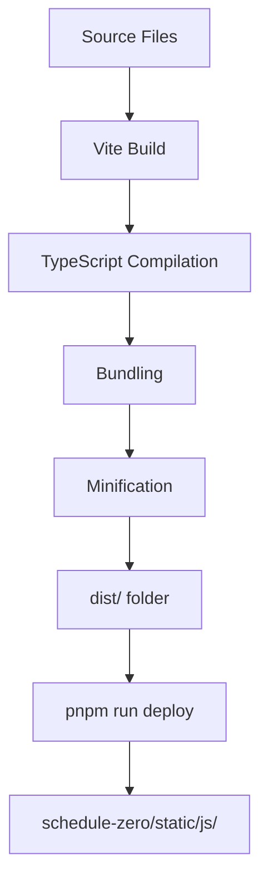

# Build Pipeline

## Overview

The build pipeline transforms TypeScript/JavaScript source files into production-ready Web Components that can be deployed to the ScheduleZero Python backend.



## Build Configuration

**File:** `vite.config.js`

```javascript
import { defineConfig } from 'vite';
import { resolve } from 'path';
import { readdirSync } from 'fs';

export default defineConfig({
  build: {
    lib: {
      entry: {
        // TypeScript components
        'components/sz-nav': resolve(__dirname, 'src/components/sz-nav.ts'),
        
        // Vanilla JS components (auto-discovered)
        ...getVanillaEntries(),
        
        // Vuetify components (auto-discovered)
        ...getVuetifyEntries()
      },
      formats: ['es'],
      fileName: (format, entryName) => `${entryName}.min.js`
    },
    outDir: 'dist',
    sourcemap: true,
    minify: 'terser',
    rollupOptions: {
      external: [],  // Bundle everything
      output: {
        preserveModules: false,
        manualChunks: undefined
      }
    }
  }
});

function getVanillaEntries() {
  const vanillaDir = resolve(__dirname, 'src/vanilla');
  const files = readdirSync(vanillaDir).filter(f => f.endsWith('.js'));
  return Object.fromEntries(
    files.map(file => [
      `vanilla/${file.replace('.js', '')}`,
      resolve(vanillaDir, file)
    ])
  );
}

function getVuetifyEntries() {
  const vuetifyDir = resolve(__dirname, 'src/vuetify');
  const files = readdirSync(vuetifyDir).filter(f => f.endsWith('.js'));
  return Object.fromEntries(
    files.map(file => [
      `vuetify/${file.replace('.js', '')}`,
      resolve(vuetifyDir, file)
    ])
  );
}
```

## Build Process Steps

### 1. TypeScript Compilation

**Input:** `src/components/sz-nav.ts`
```typescript
class SzNav extends HTMLElement {
  private config?: PortalConfig;
  // ...
}
```

**TypeScript Config:** `tsconfig.json`
```json
{
  "compilerOptions": {
    "target": "ES2020",
    "module": "ESNext",
    "lib": ["ES2020", "DOM"],
    "strict": true,
    "moduleResolution": "bundler"
  }
}
```

**Output:** JavaScript with type information stripped
```javascript
class SzNav extends HTMLElement {
  // ...
}
```

### 2. Dependency Bundling

Vite bundles all imports into single files:

**Before (multiple files):**
```
src/vuetify/schedule-grid.js
  imports vue
  imports vuetify
  imports @mdi/font
```

**After (single bundle):**
```
dist/vuetify/schedule-grid.min.js
  [Contains: vue + vuetify + @mdi + component code]
```

### 3. Minification

Terser minifies JavaScript:

**Before:**
```javascript
class SzNav extends HTMLElement {
  async connectedCallback() {
    const configUrl = this.getAttribute('config-url');
    await this.loadConfig(configUrl);
    this.render();
  }
}
```

**After:**
```javascript
class SzNav extends HTMLElement{async connectedCallback(){const t=this.getAttribute("config-url");await this.loadConfig(t),this.render()}}
```

### 4. Source Maps

Generated for debugging:

**dist/components/sz-nav.min.js.map**
```json
{
  "version": 3,
  "sources": ["../src/components/sz-nav.ts"],
  "mappings": "AAAA,MAAM,OAAO..."
}
```

Enables browser DevTools to show original TypeScript source.

## Build Commands

### Development Build
```bash
pnpm run build
```
- TypeScript compilation
- Full source maps
- No minification (fast builds)

### Production Build
```bash
pnpm run build:prod
```
- Minification enabled
- Smaller source maps
- Optimized for size

### Watch Mode
```bash
pnpm run dev
```
- Watches for file changes
- Rebuilds automatically
- Faster incremental builds

## Deployment Process

**Script:** `scripts/copy-to-python.js`

```javascript
import { cpSync } from 'fs';
import { resolve } from 'path';

const distDir = resolve(process.cwd(), 'dist');
const targetDir = resolve(
  process.cwd(),
  '../schedule-zero/src/schedule_zero/static/js/components'
);

console.log(`Copying ${distDir} → ${targetDir}`);
cpSync(distDir, targetDir, { recursive: true });
console.log('✓ Components deployed');
```

**Usage:**
```bash
pnpm run deploy
```

**Result:**
```
dist/components/sz-nav.min.js
  → schedule-zero/.../static/js/components/components/sz-nav.min.js

dist/vanilla/copy-button.min.js
  → schedule-zero/.../static/js/components/vanilla/copy-button.min.js

dist/vuetify/schedule-grid.min.js
  → schedule-zero/.../static/js/components/vuetify/schedule-grid.min.js
```

## Validation

### HTML Validation
```bash
pnpm run validate
```

Runs `scripts/validate-html.js`:
- Validates Python templates
- Checks custom element usage
- Verifies HTMX attributes
- Sanitizes Jinja2 syntax

### Portal Structure Check
```bash
pnpm run check:portal
```

Runs `scripts/check-portal.js`:
- Validates layout.html structure
- Checks component script tags
- Detects HTMX usage
- Verifies Jinja2 blocks

## Full Workflow

### Initial Setup
```bash
# Clone project
git clone <repo>
cd schdulezero-islands

# Install dependencies
pnpm install
```

### Development Cycle
```bash
# 1. Make changes to src/
vim src/components/sz-nav.ts

# 2. Build
pnpm run build

# 3. Validate (optional)
pnpm run validate

# 4. Deploy to Python project
pnpm run deploy

# 5. Test in browser
cd ../schedule-zero
poetry run python -m schedule_zero.server
# Open http://localhost:8888
```

### Continuous Development
```bash
# Terminal 1: Watch and rebuild
pnpm run dev

# Terminal 2: Python server
cd ../schedule-zero
poetry run python -m schedule_zero.server

# Terminal 3: Auto-deploy on changes
pnpm run watch:deploy
```

## Build Outputs

### Directory Structure
```
dist/
├── components/
│   ├── sz-nav.min.js
│   └── sz-nav.min.js.map
├── vanilla/
│   ├── connection-status.min.js
│   ├── connection-status.min.js.map
│   ├── copy-button.min.js
│   ├── copy-button.min.js.map
│   ├── sz-flash.min.js
│   └── sz-flash.min.js.map
└── vuetify/
    ├── schedule-grid.min.js
    ├── schedule-grid.min.js.map
    ├── schedule-form.min.js
    ├── schedule-form.min.js.map
    ├── handler-grid.min.js
    ├── handler-grid.min.js.map
    ├── execution-log-grid.min.js
    └── execution-log-grid.min.js.map
```

### File Sizes (Typical)

| Component | Uncompressed | Gzipped |
|-----------|--------------|---------|
| sz-nav.min.js | 8 KB | 3 KB |
| copy-button.min.js | 2 KB | 1 KB |
| schedule-grid.min.js | 450 KB | 140 KB |

*Vuetify components are larger due to Vue + Vuetify bundle*

## Optimization Tips

### Code Splitting
For large components, consider splitting:

```javascript
// Lazy load Vuetify components
const loadScheduleGrid = () => import('./vuetify/schedule-grid.js');

class LazyScheduleGrid extends HTMLElement {
  async connectedCallback() {
    const { ScheduleGrid } = await loadScheduleGrid();
    // ...
  }
}
```

### External Dependencies
For shared libraries (if multiple components use same library):

```javascript
// vite.config.js
export default defineConfig({
  build: {
    rollupOptions: {
      external: ['vue', 'vuetify'],
      output: {
        globals: {
          vue: 'Vue',
          vuetify: 'Vuetify'
        }
      }
    }
  }
});
```

Then load Vue/Vuetify once in layout.html:
```html
<script src="/static/js/vue.global.prod.js"></script>
<script src="/static/js/vuetify.min.js"></script>
```

## Troubleshooting

### Build Fails with TypeScript Error
```bash
# Check TypeScript directly
pnpm exec tsc --noEmit

# Fix errors in source files
```

### Component Not Updating in Browser
```bash
# Clear browser cache (hard refresh)
Ctrl+Shift+R

# Or add cache busting to script tags
<script src="/static/js/components/sz-nav.min.js?v=2"></script>
```

### Source Maps Not Working
```bash
# Verify source maps in dist/
ls dist/**/*.map

# Check browser DevTools settings:
# Settings → Sources → Enable JavaScript source maps
```

### Build is Slow
```bash
# Use watch mode for incremental builds
pnpm run dev

# Or reduce what's being built (comment out entries in vite.config.js)
```
