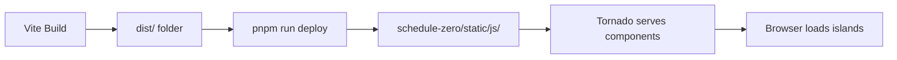

# ScheduleZero Web Components

## Overview

This project provides the **frontend Web Components** (islands) for the ScheduleZero distributed task scheduling platform. These components are built with Vite and deployed to the Python Tornado backend.

## Platform Vision

ScheduleZero is evolving from a single application to a **platform/framework** for building custom scheduling portals. See **[Platform Vision](platform-vision.md)** for details on:
- Core ScheduleZero (open source base)
- Custom portals (LogStream, AI Workflows, etc.)
- Handler ecosystems (Python, Rust, Go)
- Commercial SaaS offerings

## Documentation Overview

### 🏗️ **Architecture**
- **[Data Flow Architecture](architecture.md)** - Complete request/response flow from config to browser
- **[Platform Vision](platform-vision.md)** - ScheduleZero as a framework for custom portals
- **[Microsite Templates](microsite-templates.md)** - Reusable patterns (htmx, mkdocs, external)
- **[Documentation Strategy](documentation-strategy.md)** - Three integration strategies

### 🧩 **Development**
- **[Component Patterns](component-patterns.md)** - Building Web Components (vanilla, TypeScript, Vue)
- **[Build Pipeline](build-pipeline.md)** - Vite build process and deployment

### 📋 **Examples**
- **[Handler Docs Example](handler-docs-example.md)** - How handler projects structure their docs

## Quick Links

- [Component Reference](component-patterns.md)
- [Build & Deploy](build-pipeline.md)
- [Platform Vision](platform-vision.md)

## Component Types

### Navigation Components
- **sz-nav** - Portal navigation (TypeScript, Shadow DOM, config-driven)

### Vanilla JavaScript
- **connection-status** - WebSocket connection indicator
- **copy-button** - One-click copy to clipboard
- **sz-flash** - Flash message notifications

### Vue + Vuetify
- **schedule-grid** - Data table for schedules
- **schedule-form** - Schedule creation/editing
- **handler-grid** - Handler status table
- **execution-log-grid** - Job execution logs

## Technology Stack

- **Vite** - Build system and dev server
- **TypeScript** - Type-safe component development
- **Vue 3** - Rich UI components
- **Vuetify** - Material Design component library
- **Web Components** - Standards-based custom elements
- **Shadow DOM** - Component encapsulation

## Integration with ScheduleZero

These components are built as **islands** - independent JavaScript modules that enhance server-rendered HTML from Tornado. They integrate with HTMX for seamless server interactions.



## Getting Started

```bash
# Install dependencies
pnpm install

# Build components
pnpm run build

# Deploy to Python project
pnpm run deploy

# Run validation
pnpm run validate
```

See [Development Setup](development/setup.md) for detailed instructions.
