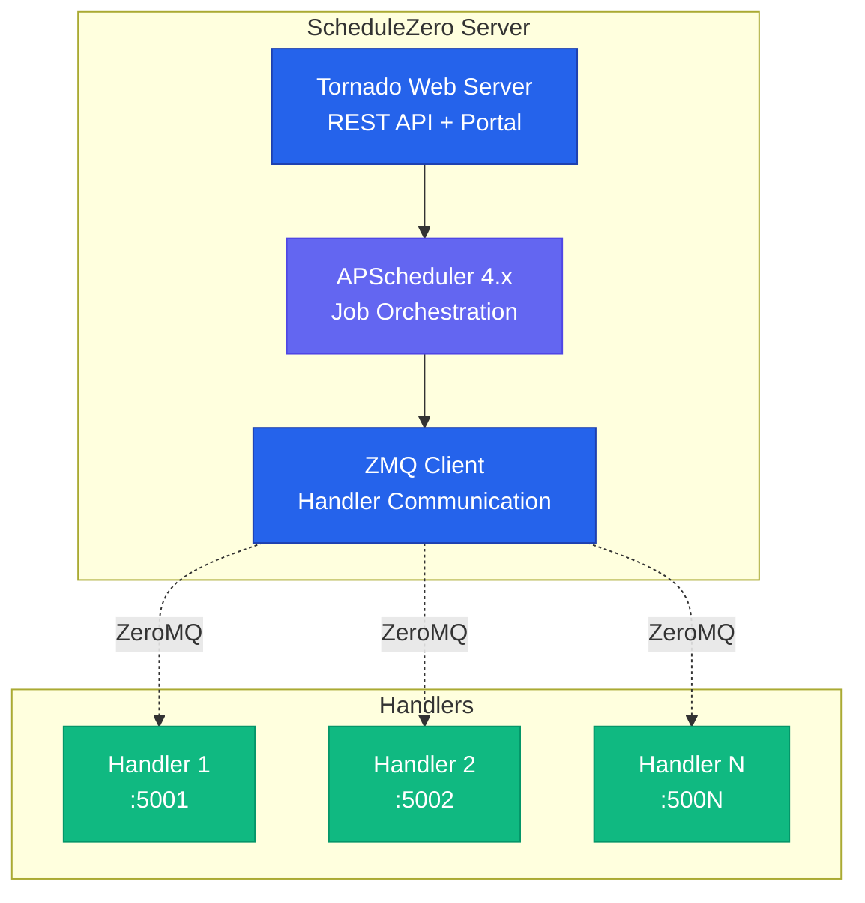

# Welcome to ScheduleZero { .schedulezero-badge }

<div style="text-align: center; margin: 2rem 0;">
    <p style="font-size: 1.5rem; color: var(--sz-primary); font-weight: 500;">
        Dynamic job scheduling with ZMQ handlers and APScheduler 4.x
    </p>
</div>

---

ScheduleZero is a powerful, flexible job scheduling system designed for modern distributed applications. It combines the robustness of **APScheduler 4.x** with the flexibility of **ZeroMQ** for seamless inter-process communication.

## :rocket: Key Features

<div class="grid cards" markdown>

-   :material-clock-fast:{ .lg .middle } **Dynamic Scheduling**

    ---

    Add, modify, or remove schedules on-the-fly via REST API. No restarts required.

    [:octicons-arrow-right-24: Learn about scheduling](concepts/scheduling.md)

-   :material-connection:{ .lg .middle } **ZMQ Handlers**

    ---

    Handlers run as separate processes with ZeroMQ communication for reliability and isolation.

    [:octicons-arrow-right-24: Explore handlers](concepts/handlers.md)

-   :material-chart-line:{ .lg .middle } **Execution Logging**

    ---

    Complete job execution history with timing metrics, success/failure tracking, and detailed logs.

    [:octicons-arrow-right-24: View API docs](api/rest.md)

-   :material-web:{ .lg .middle } **Web Portal**

    ---

    Built-in Material Design UI for schedule management, handler monitoring, and execution logs.

    [:octicons-arrow-right-24: See deployment guide](deployment/overview.md)

-   :material-cog-multiple:{ .lg .middle } **Multi-Deployment**

    ---

    Support for dev, test, production, and custom deployment configurations with separate databases.

    [:octicons-arrow-right-24: Deployment guide](deployment/single-server.md)

-   :material-robot:{ .lg .middle } **Discord Integration**

    ---

    Pre-built examples for Discord bot integration with cog architecture and sprocket system.

    [:octicons-arrow-right-24: Discord examples](examples/discord.md)

</div>

## :zap: Quick Start

### Installation

```bash
# Clone the repository
git clone https://github.com/esotericbyte/ScheduleZero.git
cd ScheduleZero

# Install with Poetry
poetry install

# Start the server (default deployment)
poetry run python start_all.py
```

### Schedule Your First Job

=== "Python"

    ```python
    import requests

    response = requests.post("http://localhost:8888/api/schedule", json={
        "handler_id": "my_handler",
        "method_name": "process_data",
        "params": {"batch_size": 100},
        "trigger": {
            "type": "interval",
            "minutes": 5
        }
    })

    print(f"Job scheduled: {response.json()}")
    ```

=== "curl"

    ```bash
    curl -X POST http://localhost:8888/api/schedule \
      -H "Content-Type: application/json" \
      -d '{
        "handler_id": "my_handler",
        "method_name": "process_data",
        "params": {"batch_size": 100},
        "trigger": {"type": "interval", "minutes": 5}
      }'
    ```

=== "JavaScript"

    ```javascript
    const response = await fetch('http://localhost:8888/api/schedule', {
      method: 'POST',
      headers: { 'Content-Type': 'application/json' },
      body: JSON.stringify({
        handler_id: 'my_handler',
        method_name: 'process_data',
        params: { batch_size: 100 },
        trigger: { type: 'interval', minutes: 5 }
      })
    });

    const result = await response.json();
    console.log('Job scheduled:', result);
    ```

## :building_construction: Architecture Overview



**Key Components:**

- **Tornado Web Server**: REST API and web portal for managing schedules
- **APScheduler 4.x**: Async job scheduling with persistent storage
- **ZMQ Client**: Communicates with handlers via request-reply pattern
- **Handlers**: Independent processes that execute scheduled jobs

## :books: Learning Path

<div class="grid" markdown>

<div class="card" markdown>

### :beginner: Getting Started

New to ScheduleZero? Start here!

- [Installation Guide](getting-started/installation.md)
- [Quick Start Tutorial](getting-started/quickstart.md)
- [Core Concepts](concepts/architecture.md)

</div>

<div class="card" markdown>

### :hammer_and_wrench: Development

Ready to build with ScheduleZero?

- [Creating Handlers](concepts/handlers.md)
- [Scheduling Jobs](concepts/scheduling.md)
- [REST API Reference](api/rest.md)

</div>

<div class="card" markdown>

### :rocket: Deployment

Going to production?

- [Deployment Overview](deployment/overview.md)
- [Single Server Setup](deployment/single-server.md)
- [Multi-Instance Config](deployment/overview.md)

</div>

<div class="card" markdown>

### :package: Examples

Learn from real-world examples!

- [Discord Bot Integration](examples/discord.md)
- [Cog + Sprocket Pattern](examples/discord.md#cog-sprocket-architecture)
- [Custom Handlers](api/handlers.md)

</div>

</div>

## :star: Why ScheduleZero?

!!! success "Production Ready"
    Built on battle-tested APScheduler 4.x with async support and persistent storage. Proven stable for 19+ hours of continuous operation.

!!! tip "Developer Friendly"
    Simple REST API, clear documentation, and extensive examples. Get started in minutes.

!!! info "Flexible Architecture"
    Handlers run independently with ZeroMQ isolation. Add new functionality without touching the core server.

!!! warning "Active Development"
    ScheduleZero is under active development. Check the [GitHub repository](https://github.com/esotericbyte/ScheduleZero) for the latest updates.

---

<div style="text-align: center; margin: 3rem 0 1rem 0;">
    <strong>Ready to get started?</strong> Follow the <a href="getting-started/installation.md">Installation Guide</a> →
</div>

